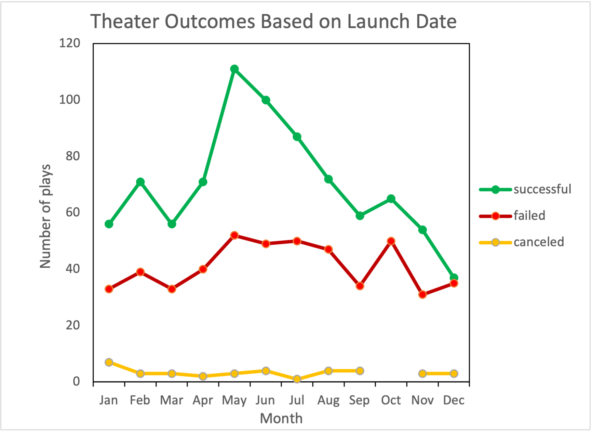
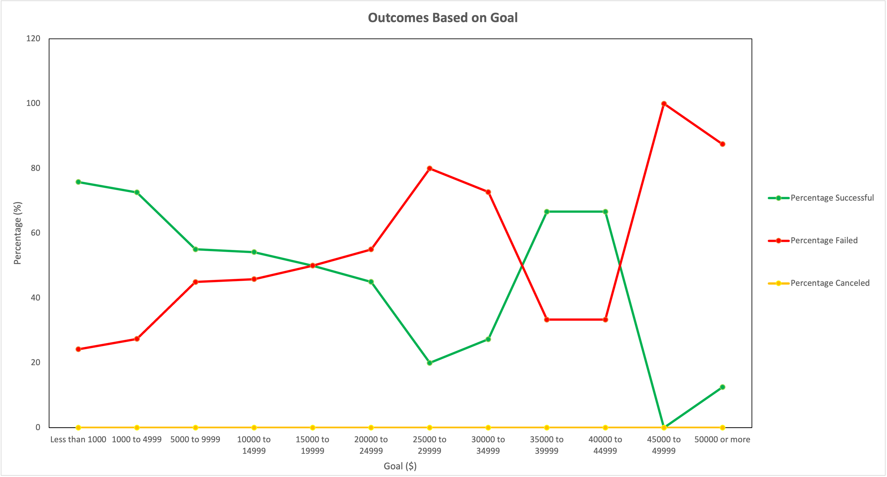

# Kickstarting with Excel

## Outcomes of theatrical productions

### Identify performance of theater plays based on launch date and funding goals

By use of basic excel tools, it could be seen in a graphic content the trend of the sorted data. Though analysis could be made on a greater scale, the focus was made on a particular matter of success relative to founding and monetary intention. Data will be analyzed to represent the outcomes of theatrical productions plays.

---

## Analysis and Challenges

### Analysis of Outcomes Based on Launch Date
Filtering and sorting data will be the fisrt step. It can be a challenge as data is not ready to use, it has to be done a conversion of the dates from Unix timestamps (using a simple conversion formula that takes into consideration the seconds, minutes and hours of a day) to actual date using 1/1/1970 as reference and the "=YEAR()" excel function to extract the year at the time of opening, also separating the Parent categories and subcategories (using the 'Text to columns' tool on the Data tab) will be useful to sort through parent category 'Theater' and subcategory 'plays'.

By creating a pivot table, taking as filter reference parent category 'Theater' and 'years' to compare successful, failed and canceled outcomes in a calendar year. This relation could be appreciated in the following chart.

Besides the sorting of the data to be readable and useful, another challenge using data could be selecting the appropiate information to take into account to create relationships and showcase results. In this case, filtering through plays on a pivot chart over the years, led us to collect useful information about the outcomes.  

### Analysis of Outcomes Based on Goals
This time, a tabular table was created based on our Kickstarter data, initial monetary values and subcategory 'plays' served as reference to make the sorting, by using "=COUNTIFS()" excel tool. Likewise, operations in the outcomes column to filter and extract the information needed, the function "=SUM()" to group the results and sort percentages with a basic mathematical calculation (Outcome/SUM * 100) inside  "=IFERROR()" function, to prevent errors from data with zero values. A visual representation of percentage of success, failure and canceled plays is displayed in the following line chart. 

Possible challenges could be present if there was a more specific question which requires calculations and use of complex formulas to work with or with a more quantity of data that gives more room for error. 

--- 

## Results

- What are two conclusions you can draw about the Outcomes based on Launch Date?
- 
- What can you conclude about the Outcomes based on Goals?

- What are some limitations of this dataset?

- What are some other possible tables and/or graphs that we could create?
